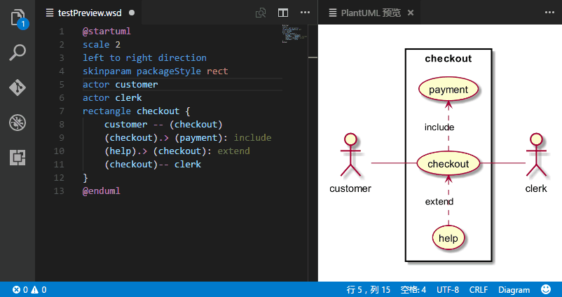
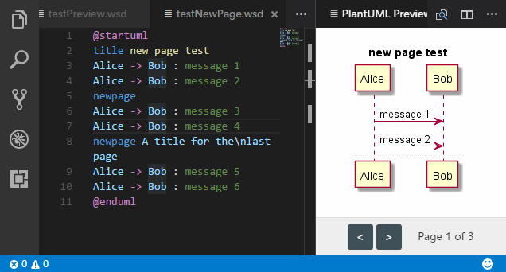
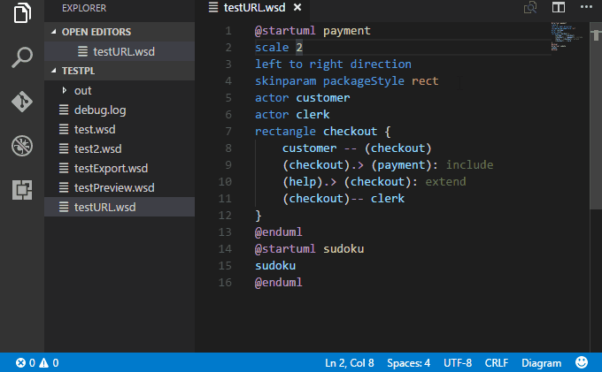
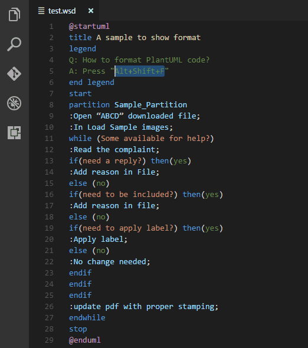
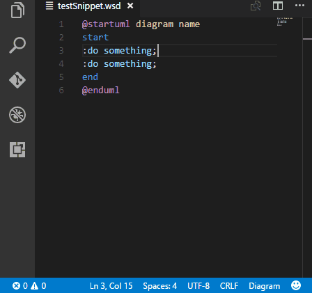
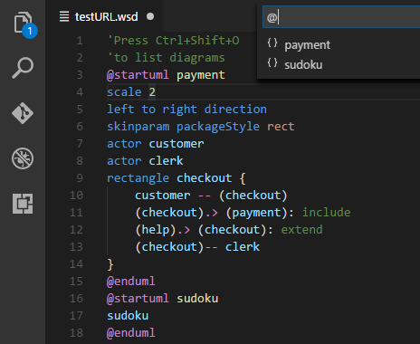
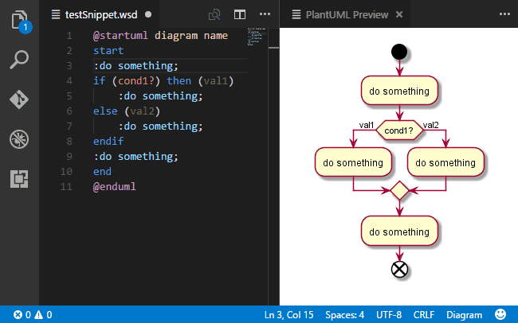
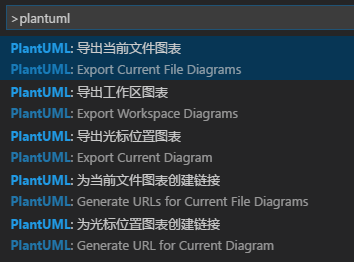
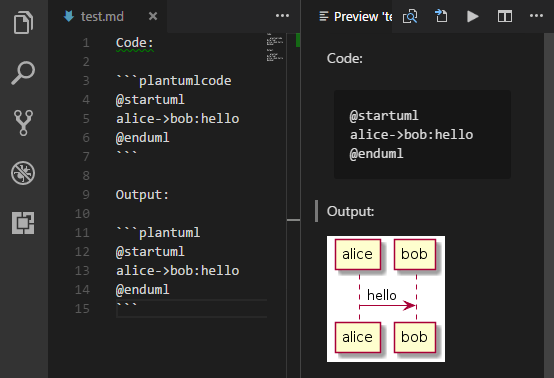

# PlantUML README

Rich PlantUML support for Visual Studio Code.

[Donate by Paypal](https://paypal.me/qjebbs "If you like this plugin, you can buy me a coffee. Feel free if you don't want to, since it's free!")
|
[Donate by AliPay](https://github.com/qjebbs/vscode-plantuml/blob/master/images/alipay.png?raw=true)
|
[PlantUML Document](http://plantuml.com/sitemap-language-specification)

Note that some settings are changed after Version 2.0.0:

- `plantuml.previewFromUrlServer` has been replaced by `plantuml.render`
- `plantuml.urlServer` has been renamed to `plantuml.server`
- `plantuml.urlServerIndexParameter` has been renamed to `plantuml.serverIndexParameter`

> Get **15X times faster export** by utilizing PlantUML Server as render. [How to?](#about-render)

## Features

- Preview Diagram, Press `Alt-D` to start PlantUML preview.
  - Auto update.
  - Zoom & scroll support.
  - Multi-Page Diagram support.
  - Instant preview, if diagram's been exported.
  - From local or server.
- Export Diagrams
  - At cursor, in current file, in whole workspace, in workspace selected.
  - Concurrent export.
  - Generate URLs.
  - Multi-Page Diagram support.
  - From local or server.
  - Image map (cmapx) support.
- Editing Supports
  - Format PlantUML code.
  - All type syntax highlight.
  - All type snippets.
  - Auto Include.
  - Symbol List support.
- Others
  - Multi-root Workspace Support.  **NEW!!**
  - MarkDown integrating support. [View Demo](#markdown-integrating)
  - Extracting source from images support.

> Notice: If you use customize `plantuml.jar`, please update to the latest version to enable `Multi-Page Diagram support`. (Later than `V1.2017.15`)

## How to install

Launch VS Code Quick Open (Ctrl+P), paste the following command, and press enter.

`ext install plantuml`

## Requirements

Depend on which render you choose, plugin has diffrerent requirements.

### Requirements for PlantUMLServer render

A plantuml server.  See [Use PlantUML Server as render](#use-plantuml-server-as-render).

### Requirements for Local render

It's necessary to have following installed:

- [Java][Java] : Platform for PlantUML running.
- [Graphviz][Graphviz] : PlantUML requires it to calculate positions in diagram.

[Java]: http://java.com/en/download/ "Download Java"
[Graphviz]: http://www.graphviz.org/Download/ "Download Graphviz"

> Plugin has integrated a copy of "plantuml.jar", you are good to go now. But if you want to use your own jar (maybe a newer version, or with many dependent jars), specify the jar location with setting `plantuml.jar`.

> If you've installed java, but still prompts "java not installed", please add java bin path to `PATH` environment variable.

For windows user, [majkinetor](https://github.com/majkinetor) introduced a way to install plantuml and its dependencies easily. Run `cmd.exe` as Administrator, and run two commands as follow

```cmd
@"%SystemRoot%\System32\WindowsPowerShell\v1.0\powershell.exe" -NoProfile -ExecutionPolicy Bypass -Command "iex ((New-Object System.Net.WebClient).DownloadString('https://chocolatey.org/install.ps1'))" && SET "PATH=%PATH%;%ALLUSERSPROFILE%\chocolatey\bin"

choco install plantuml
```

## Preview and Export Demos

Auto update:



zoom & scroll:


Multi-Page View:



Export diagram:


Generate URLs:



## Extract Diagram Source


## About Format



## About Snippets



This plugin integrates all type diagram snippets. They are splitted into 9 sections:

- `diagram`: snippets for general diagrams elements.
- `activity`: snippets for activity diagrams.
- `class`: snippets for class diagrams.
- `component`: snippets for component diagrams.
- `state`: snippets for state diagrams.
- `usecase`: snippets for usecase diagrams.
- `sequence`: snippets for sequence diagrams.
- `ui`: snippets for salt diagrams.
- `egg`: snippets for some funny diagrams, like sudoku, earth.

For exsample, type `activity if else condition` or `acif` (short version) to trigge following snippet:

```plantumlcode
if (cond1?) then (val1)

else (val2)

endif
```

## About Symbol List (List diagrams of file)



Press `Ctrl+Shift+O` to list all diagrams in the file. You can name the diagram when diagram starts.

> @startuml diagram name
> sudoku
> @enduml

## About Render

Plugin supports two renders: `Local` and `PlantUMLServer`.

Local is the default and traditional way. If you care more about export speed, you should try PlantUMLServer.

```text
Local: 6 documents, 9 digrams, 14 files exported in 24.149 seconds
PlantUMLServer: 6 documents, 9 digrams, 14 files exported in 1.564 seconds
```

## Advantages and disadvantages of PlantUMLServer render

Advantages:

- 15X times faster export and much quicker preview response.
- Don't have to set local enviroments if you have a server in your team.
- You don't need `plantuml.exportConcurrency`, because it's unlimited in concurrency.

Disadvantages:

- Cannot render very-large diagrams (HTTP 413 error).
- Cannot render diagrams with `!include` in it.
- Less format support: png, svg, txt.
- Some settings are not applicable: `plantuml.jar`, `plantuml.commandArgs`, `plantuml.jarArgs`.
- Cannot collect syntax error of diagrams in report.

## Use PlantUML Server as render

- You may already have a PlantUML server in your team, find the server address, like: `http://192.168.1.100:8080/plantuml`.

- If don't have one, you can set up on you own ([follow the instructions](https://github.com/plantuml/plantuml-server)). Find the server address, like: `http://localhost:8080/plantuml`, or `http://192.168.1.100:8080/plantuml` which is ready for sharing to your team.

- Open user setting, and configure like:

```text
"plantuml.server": "http://192.168.1.100:8080/plantuml",
"plantuml.render": "PlantUMLServer",
```

## About Auto Include

> Notice: People who don't use `!include` could ignore this chapter.



Auto Include liberates you from writing "!include path/to/include.wsd" everywhere. which is bother & hard to manage.

Suppose we have 2 files to include: `defines.wsd` and `myStyles.wsd`, and they are organized as follow:

```text
├── includes
│   ├── defines.wsd
│   └── myStyles.wsd
├── sources
│   ├── sourceA.wsd
│   └── sourceB.wsd
├── out
```

In the past, we have to include them manually in every single diagram:

```plantumlcode
@startuml
!include ../includes/defines.wsd
!include ../includes/myStyles.wsd
'contents goes here...
@enduml
```

Now, you can just replace them with a placehold `'autoinclude`,

```plantumlcode
@startuml
'AutoInclude
'contents goes here...
@enduml
```

and open workspace setting and config:

```text
"plantuml.includes": [
    "includes"
]
```

### About integrated theme

Plugin shipped with a blue diagram theme, to enable it, config like:

```text
"plantuml.includes": [
    "styles/blue"
]
```

## Multiple languages support

Translations are welcome. [lang.nls.json](https://github.com/qjebbs/vscode-plantuml/blob/develop/langs/lang.nls.json), [package.nls.json](https://github.com/qjebbs/vscode-plantuml/blob/develop/package.nls.json)



## MarkDown integrating



`@startuml / @enduml` is still recommended, so that PlantUML code in Markdown can be managed by other function of this plugin.

## Extension Settings

This extension contributes the following settings:

- `plantuml.jar`: Alternate plantuml.jar location. Leave it blank to use integrated jar.
- `plantuml.fileExtensions`: File extensions that find to export. Especially in workspace settings, you may add your own extensions so as to export diagrams in source code files, like ".java".
- `plantuml.exportFormat`: format to export. default is not set, user may pick one format everytime exports. You can still set a format for it if you don't want to pick.
- `plantuml.exportSubFolder`: export diagrams to a folder which has same name with host file.
- `plantuml.exportConcurrency`: decides concurrency count when export multiple diagrams.
- `plantuml.exportOutDirName`: export workspace diagrams will be organized in a directory named with value specified here.
- `plantuml.exportMapFile`: Determine whether export image map (.cmapx) file when export.
- `plantuml.previewAutoUpdate`: Dedecides if automatically update the preview window.
- `plantuml.previewFileType`: Preview file type, png or svg support. But svg preview cannot support sudoku, earth diagrams etc.
- `plantuml.server`: PlantUML server to generate UML diagrams on-the-fly.
- `plantuml.render`: Select diagram render for both export and preview.
- `plantuml.urlFormat`: URL format. Leave it blank to pick format everytime you generate a URL.
- `plantuml.urlResult`: URL result type. Simple URL or ready for MarkDown use.
- `plantuml.includes`: Files or folders to include before preview/export diagrams. You don't have to write "!include path/to/include.wsd" for every single diagram any more.
- `plantuml.commandArgs`: commandArgs allows you add command arguments to java command, such as `-DPLANTUML_LIMIT_SIZE=8192`.
- `plantuml.jarArgs`: jarArgs allows you add arguments to plantuml.jar, such as `-config plantuml.config`.

## Known Issues

Please post and view issues on [GitHub][issues]

[issues]: https://github.com/qjebbs/vscode-plantuml/issues "Post issues"

## Thanks

- [Kohei Arao](https://github.com/koara-local)
- [zhleonix](https://github.com/zhleonix/vscode-plantuml-ext/blob/r1.0.0/snippets/snippets.json)
- [Eward Song](https://github.com/shepherdwind)
- [Martin Riedel](https://github.com/rado0x54)

## Translators

- Japanese: [Kohei Arao](https://github.com/koara-local)
- Tranditional Chinese: [Alan Tsai](https://github.com/alantsai)
- German: [Fabian F.](https://github.com/fur6y)

## Donators

Thanks for your encouragements!

    Claus Appel, 三島木​一磨

-----------------------------------------------------------------------------------------------------------

**Enjoy!**
